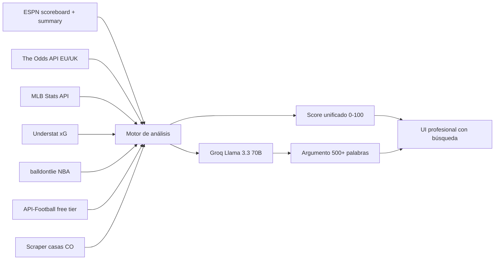

# InfoBet — Agente de picks deportivos

Plataforma de análisis y pronósticos deportivos enfocada en el mercado **colombiano**. Combina datos abiertos (ESPN, MLB Stats API, Understat, balldontlie, API-Football), scraping de cuotas reales en casas locales (Wplay, Rushbet, Betsson CO, Yajuego, Sportium) y argumentos extensos generados con Groq (Llama 3.3 70B) para entregar picks con un único **score 0–100** y un análisis de 500+ palabras por jugada.

## Highlights v5

- 4 deportes: **fútbol, baloncesto, tenis, béisbol**, cada uno con whitelist de mercados.
- **Cuotas reales priorizadas** desde casas colombianas; fallback a The Odds API EU/UK.
- **Argumento por pick de 500+ palabras** generado por Groq, cacheado en disco para no repetir costos.
- **Score unificado 0–100** que combina convicción del modelo, edge y calidad de los datos.
- **UI rediseñada**: búsqueda libre, filtros por deporte/liga/mercado, slider de score, modal de análisis completo, tracker de ROI, vista en vivo.

## Arquitectura



## Stack

- **Backend**: Node 18+, Express 4, ESM puro.
- **Scraping**: `fetch` nativo + `cheerio`.
- **LLM**: Groq API (`llama-3.3-70b-versatile`, fallback `llama-3.1-8b-instant`).
- **Frontend**: HTML estático servido por Express, sin framework.

## Setup

```bash
git clone <repo>
cd Personal_K
npm install
npm start
# → http://localhost:8787
```

### Variables de entorno

| Variable                | Requerida | Para qué sirve                                           |
|-------------------------|-----------|----------------------------------------------------------|
| `GROQ_API_KEY`          | recomendada | Genera los argumentos extensos. Sin esta key se usa una plantilla estadística como fallback. Obtenla gratis en https://console.groq.com/keys |
| `ODDS_API_KEY`          | opcional  | Cuotas EU/UK desde The Odds API (fallback si el scraping CO falla). https://the-odds-api.com |
| `RAPIDAPI_KEY`          | opcional  | API-Football free tier para ligas no europeas (MLS, Liga MX, copas LATAM). https://rapidapi.com/api-sports/api/api-football |
| `GROQ_MODEL_PRIMARY`    | opcional  | Override del modelo Groq principal (default `llama-3.3-70b-versatile`). |
| `GROQ_MODEL_FALLBACK`   | opcional  | Override del modelo Groq de respaldo (default `llama-3.1-8b-instant`). |
| `PORT`                  | opcional  | Puerto del servidor (default `8787`). |

Ejemplo `.env` (cargarlo manualmente o exportarlo en tu shell):

```
GROQ_API_KEY=gsk_xxxxxxxxxxxxxxxxxxxxxxxxxxxxxxxxxx
ODDS_API_KEY=xxxxxxxxxxxxxxxxxxxxxxxxxxxxxxxx
RAPIDAPI_KEY=xxxxxxxxxxxxxxxxxxxxxxxxxxxxxxxx
```

## Fuentes de datos

| Fuente              | Cobertura                                          | Cache    | Auth |
|---------------------|----------------------------------------------------|----------|------|
| ESPN scoreboard     | Scores, eventos, records, leaders por deporte y liga | 12 min  | no   |
| ESPN summary        | Estadísticas avanzadas por evento                  | 12 min  | no   |
| MLB Stats API       | Lanzador probable, bateo por equipo                | 12 min  | no   |
| The Odds API        | Cuotas h2h y totals (EU/UK) — fallback             | 12 min  | sí   |
| Understat           | xG / xGA y forma de las 5 grandes ligas europeas   | 30 min  | no   |
| balldontlie         | Promedios NBA por jugador                          | 6 h     | no   |
| API-Football        | Forma de equipo en MLS, Liga MX, Liga Argentina, copas LATAM | 30 min | sí |
| **Scrape CO**       | Wplay, Rushbet, Betsson CO, Yajuego, Sportium      | 5 min   | no   |
| Groq Llama 3.3 70B  | Argumento extenso de 500+ palabras por pick        | disco   | sí   |

## Catálogos habilitados

### Ligas

- **Fútbol**: LaLiga, Premier League, Serie A, Ligue 1, Bundesliga, Liga Portugal, MLS, Liga MX, Primera A Colombia, Liga Argentina, Brasileirao Serie A, Champions, Europa, Conference, Mundial, Mundial de Clubes, Libertadores, Sudamericana, Concachampions, FA Cup, Carabao Cup, Copa del Rey, Coppa Italia, Coupe de France, Taça de Portugal, US Open Cup, Copa BetPlay, Copa Argentina.
- **Baloncesto**: NBA, WNBA, Euroliga, Liga ACB (España).
- **Tenis**: solo eventos de tour principal (ATP/WTA Grand Slams, Masters, ATP/WTA Tour). Challenger e ITF se filtran.
- **Béisbol**: MLB.

### Mercados

| Deporte       | Mercados habilitados                                                               |
|---------------|-------------------------------------------------------------------------------------|
| Fútbol        | Ganador · Doble oportunidad · Hándicap · Tiros de esquina · Tarjetas · Totales · Player props · Combinadas |
| Baloncesto    | Player props · Ganador · Hándicap · Puntos por equipo · Total partido · Combinadas |
| Tenis         | Ganador · Total juegos/sets · Player props (solo tour principal)                   |
| Béisbol       | Ganador · Total carreras · Run line · Player props · Combinadas                    |

## Cómo se calcula el score

```
score = clamp( convicción × 0.45  +  edge × 0.30  +  calidad de datos × 0.25 , 0, 100 )

donde
  convicción       = max(p, 1-p) escalado de 0.5..0.9 → 0..100
  edge             = (model_prob - 1/odds) escalado tope 0.12 → 100
  calidad de datos = 0..1 según fuentes activas (ESPN, cuotas CO, xG, MLB, etc.)
```

Tier cualitativo:

| Score   | Etiqueta            |
|---------|---------------------|
| ≥ 80    | Pick élite          |
| 65–79   | Pick fuerte         |
| 50–64   | Pick razonable      |
| < 50    | Pick especulativo   |

## Estructura del repo

```
src/
  config/
    leagues.js      catálogo de ligas habilitadas
    markets.js      whitelist de mercados por deporte
  data/
    espn.js         feeds y summaries ESPN
    odds.js         The Odds API + applyRealOddsToPickList (CO > EU)
    colombian_odds.js  scraping de Wplay/Rushbet/Betsson/Yajuego/Sportium
    understat.js    xG / forma top Europa
    balldontlie.js  stats NBA
    apifootball.js  forma fútbol no europeo
    mlb.js          lanzador probable + bateo
    llm.js          cliente Groq con retry + fallback
    evidence.js     bundle de evidencia por evento
    tracker.js      persistencia bets.json
  analyzers/
    soccer.js       picks de fútbol
    basketball.js   picks de baloncesto
    tennis.js       picks de tenis (filtro tour principal)
    baseball.js     picks de béisbol
  model/
    scoring.js      pickScore, dataQualityFromPick, scoreTier
    props.js        estimación de probabilidades por mercado
    calibration.js  ajustes históricos
  picks/
    collector.js    orquestación del lote diario
    enricher.js     enriquecimiento + attachScores
    argumentBuilder.js  argumento Groq + cache disco
    builders.js     constructores de picks
  routes/
    api.js          /api/picks /api/live-picks /api/league-catalog
    tracker.js      /api/tracker/*
  cache/
    feeds.js        caché en memoria con stale-while-revalidate
data/
  arguments/        cache de argumentos generados por Groq (1 archivo por pick)
  bets.json         tracker de apuestas registradas
index.html          UI completa (HTML + CSS + JS sin build step)
server.js
package.json
```

## API

| Endpoint                       | Método | Descripción                                         |
|--------------------------------|--------|-----------------------------------------------------|
| `/api/picks?targetDate=YYYY-MM-DD` | GET    | Picks del día con argumentos y score.            |
| `/api/live-picks`              | GET    | Solo picks de eventos en curso.                     |
| `/api/league-catalog`          | GET    | Ligas habilitadas por deporte.                      |
| `/api/tracker/bets`            | GET    | Listado de apuestas registradas.                    |
| `/api/tracker/stats`           | GET    | ROI, win rate, stats por sport/market/score-tier.   |
| `/api/tracker/bets`            | POST   | Registrar apuesta.                                  |
| `/api/tracker/bets/:id`        | PATCH  | Marcar resultado (win/loss/push/pending).           |
| `/api/tracker/bets/:id`        | DELETE | Borrar apuesta.                                     |

## Reglas estrictas del motor

- **Sin fallback genérico**: si faltan datos reales mínimos (records < 8 partidos en fútbol, sin ranking en tenis, sin lanzador/bateo en MLB cuando aplica), el pick **no se emite**.
- **Whitelist de mercados**: cada analizador respeta `ENABLED_MARKETS` de `src/config/markets.js`. Cualquier mercado no listado se descarta antes de exportar.
- **Cuotas reales priorizadas**: se intenta primero el promedio CO; si no hay, se usa The Odds API; solo si tampoco hay se usa la cuota estimada por el modelo.
- **Argumentos**: si Groq no responde o no hay key, se entrega una plantilla estadística que cumple las 6 secciones. El usuario siempre ve el `dataQuality` para distinguir.

## Disclaimer

Este software entrega **análisis informativo**, no garantías de ganancia. Las apuestas deportivas implican riesgo y deben practicarse con moderación. No apuestes más de lo que puedes permitirte perder.
